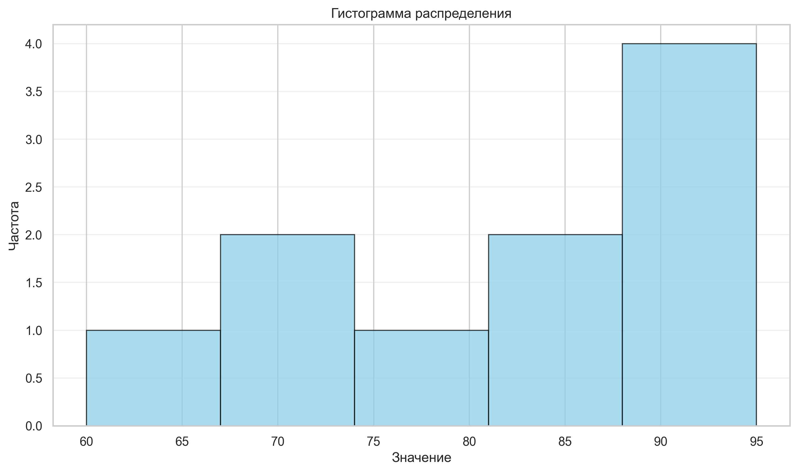
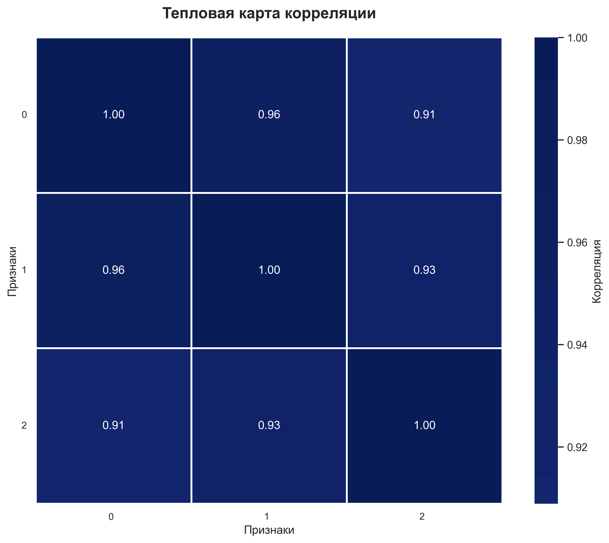
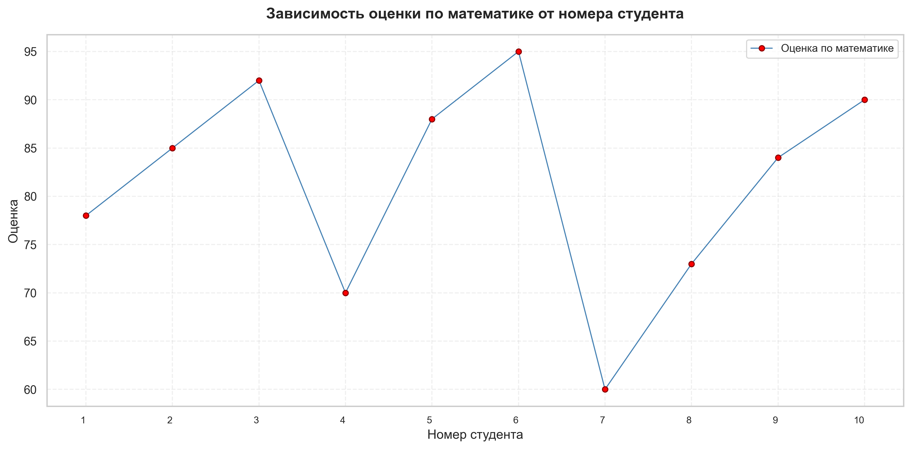

# Лабораторная работа 2
**Тема:** Численные вычисления и анализ данных с использованием NumPy
## Цель работы

Освоить базовые возможности библиотеки NumPy для численных вычислений: создание и обработка массивов, выполнение векторных и матричных операций, статистический анализ данных. Научиться визуализировать результаты с помощью Matplotlib и Seaborn, а также покрывать код тестами с использованием pytest.

## Задание

Разработать набор функций для работы с массивами NumPy, выполнить статистический анализ данных из CSV-файла и построить три типа графиков:

- гистограмму распределения оценок по математике;

- тепловую карту корреляции между предметами;

- линейный график зависимости оценки от номера студента.

Все функции должны проходить автоматические тесты, написанные с помощью pytest.

---
## Ход выполнения
### 1. Структура проекта

```
Проект организован следующим образом:
numpy_lab/
├── main.py               # основной модуль с реализацией функций
├── test.py               # тесты (pytest)
├── data/
│   └── students_scores.csv  # исходные данные
└── plots/                # папка для сохранения графиков (создаётся автоматически)
    ├── histogram.png
    ├── heatmap.png
    └── line_plot.png
```

### 2. Реализация функций
#### 2.1. Создание и обработка массивов

    create_vector() – массив от 0 до 9 (np.arange(10)).

    create_matrix() – матрица 5×5 со случайными числами из [0,1) (np.random.rand(5,5)).

    reshape_vector(vec) – изменение формы (10,) → (2,5) (vec.reshape(2,5)).

    transpose_matrix(mat) – транспонирование (mat.T).

#### 2.2. Векторные операции

    vector_add(a, b) – поэлементное сложение (a + b).

    scalar_multiply(vec, scalar) – умножение вектора на число (vec * scalar).

    elementwise_multiply(a, b) – поэлементное умножение (a * b).

    dot_product(a, b) – скалярное произведение (np.dot(a, b)).

#### 2.3. Матричные операции

    matrix_multiply(a, b) – матричное умножение (a @ b).

    matrix_determinant(a) – определитель (np.linalg.det(a)).

    matrix_inverse(a) – обратная матрица (np.linalg.inv(a)).

    solve_linear_system(a, b) – решение СЛАУ Ax = b (np.linalg.solve(a, b)).

#### 2.4. Статистический анализ

    load_dataset(path) – загрузка CSV с помощью pandas и преобразование в массив NumPy.

    statistical_analysis(data) – вычисление для одномерного массива:

    - среднее (np.mean)

    - медиана (np.median)

    - стандартное отклонение (np.std)

    - минимум, максимум

    - 25-й и 75-й перцентили (np.percentile)

    normalize_data(data) – Min-Max нормализация по формуле (x - min) / (max - min).

#### 2.5. Визуализация

Все графики сохраняются в папку plots с разрешением 300 dpi.

Гистограмма (plot_histogram)

Построена для оценок по математике. Использовано 5 интервалов (bins), цвет столбцов – небесно-голубой с чёрной окантовкой. Добавлены заголовок, подписи осей и сетка.



---
Тепловая карта корреляции (plot_heatmap)

Для матрицы корреляции трёх предметов (math, physics, informatics) построена тепловая карта с аннотациями значений. Цветовая схема – YlGnBu, белые разделительные линии толщиной 1.5.


---
Линейный график (plot_line)

Отображает зависимость оценки по математике от номера студента. Для наглядности добавлены маркеры (красные точки), легенда и сетка. При большом количестве студентов метки по оси X автоматически прореживаются.


---
## Результаты
- На гистограмме видно, что большинство студентов получили оценки в диапазоне 80–95, причём наибольшее количество – 90 и 95 баллов.

- Корреляционная матрица показывает высокую положительную связь между всеми тремя предметами (коэффициенты от 0.91 до 0.96). Наибольшая корреляция – между математикой и физикой (0.96).

- График иллюстрирует индивидуальные результаты студентов. Видно, что оценки варьируются от 60 до 95, без явной тенденции к росту или падению в зависимости от номера студента.

## Тестирование
Для проверки корректности всех функций используется модуль test.py на pytest. Тесты охватывают:

- создание массивов;

- векторные и матричные операции;

- загрузку данных и статистический анализ;

- нормализацию;

- вызов функций визуализации (проверка отсутствия ошибок).

## Выводы

В ходе выполнения лабораторной работы был разработан скрипт для численных вычислений и статистического анализа данных. Использование библиотеки NumPy позволило векторизовать математические операции и оптимизировать работу с матрицами, включая расчет определителя, нахождение обратной матрицы и решение систем линейных уравнений.

**Ключевые технические результаты:**

* **Интеграция инструментов:** Успешно совмещены возможности Pandas для чтения CSV-файлов и NumPy для расчетов статистических метрик (среднее, перцентили) и нормализации массивов.
* **Анализ и визуализация:** Сгенерированы репрезентативные графики (гистограмма, тепловая карта `sns.heatmap` с палитрой `YlGnBu` и линейный график) для оценки распределения баллов и выявления корреляции между предметами. 
* **Изоляция окружения:** Решена проблема падения тестов из-за отсутствия GUI (`_tkinter.TclError`) путем принудительного использования неинтерактивного бэкенда `matplotlib.use('Agg')`.
* **Покрытие тестами:** Логика вычислений и загрузки данных валидирована через фреймворк `pytest`. Для независимости тестов от реального датасета применялись временно генерируемые CSV-файлы и фиктивные матрицы.

Выполнение работы закрепило практические навыки обработки многомерных массивов в Python и автоматизации генерации визуального контента для публикации в статическом сайте-портфолио на базе MkDocs.

---

**Исходный код:** [тут](https://github.com/healbane/ITMO/tree/main/PYTHON/2/LAB2)

**Дата выполнения:** 12.03.2026
